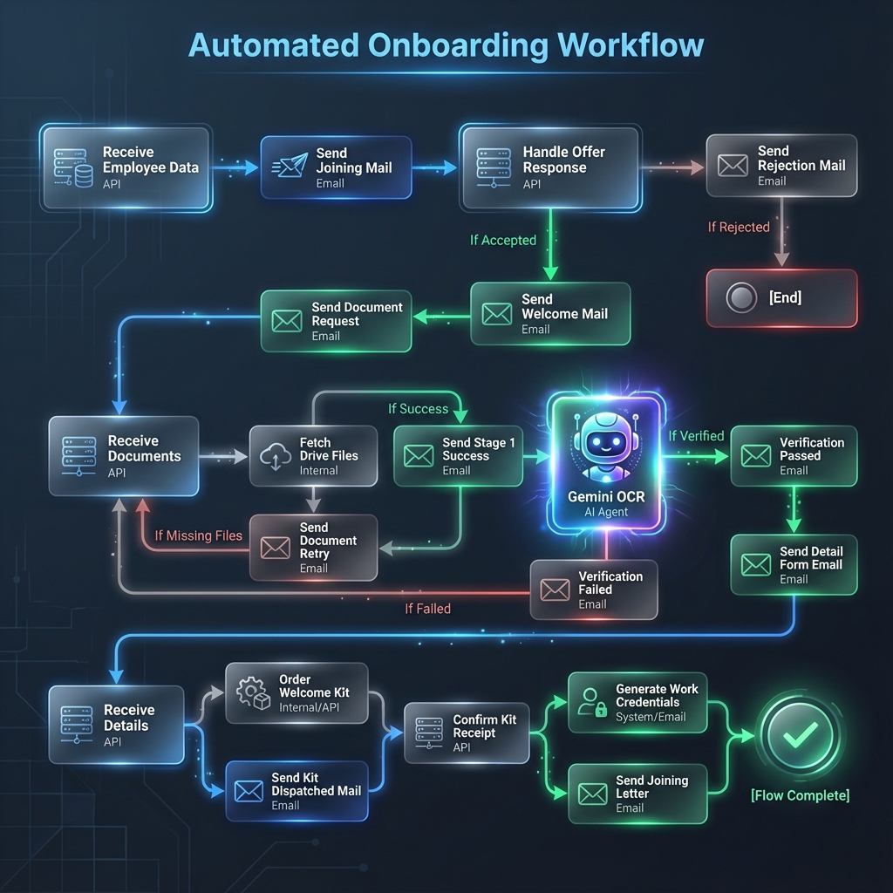

# 🚀 Motia Onboarding Automation System

Welcome to the **Motia Onboarding Automation System**, a comprehensive solution designed to streamline and automate the employee onboarding process. This project is a monorepo containing both the premium, event-driven backend and the aesthetic, user-friendly frontend.

## 📂 Project Structure

The project is divided into two main components:

*   **`frontend/`**: The React-based user interface for HR Admins to initiate onboarding and for candidates to complete their details and accept offers.
*   **`hack/`**: The Motia-powered backend that handles the event-driven workflows, API endpoints, background jobs, and integrations.

## ✨ Key Features

*   **Automated Workflows**: Seamlessly orchestrates the entire onboarding journey from offer letter to joining day.
*   **Event-Driven Architecture**: Powered by **Motia**, ensuring reliable execution of steps like email sending, document verification, and credential generation.
*   **Aesthetic UI**: A modern, glassmorphism-inspired interface built with **Vite** and **Tailwind CSS**.
*   **Candidate Portal**: Secure pages for candidates to accept offers, upload documents, and provide personal details.
*   **Real-time Status**: Tracking of the onboarding progress.

## 🚀 Getting Started

To run the full system, you need to start both the backend and the frontend.

### 1. Start the Backend (`hack/`)

The backend powers the API and the Motia workflow engine.

```bash
cd hack
npm install
npm run dev
```
*The backend/workbench typically runs on `http://localhost:3000`.*

### 2. Start the Frontend (`frontend/`)

The frontend provides the user interface.

```bash
cd frontend
npm install
npm run dev
```
*The frontend typically runs on `http://localhost:5173`.*

## 🔗 Architecture Overview



1.  **HR Admin** initiates onboarding via the Frontend.
2.  **Frontend** sends a request to the **Backend**.
3.  **Backend** triggers a **Motia Workflow** (e.g., Send Offer Letter).
4.  **Candidate** receives an email with a link to the **Frontend** (e.g., `/respond`).
5.  **Candidate** actions (Accept/Decline, Upload Docs) trigger further events in the **Backend**.

## 🛠️ Tech Stack

*   **Frontend**: React, Vite, Tailwind CSS
*   **Backend**: Motia Framework (Node.js/TypeScript)
*   **Integrations**: Email Services, Google Drive (for docs), Database (MongoDB/PostgreSQL - *configured in backend*)

---
*Built for the Hackathon*

